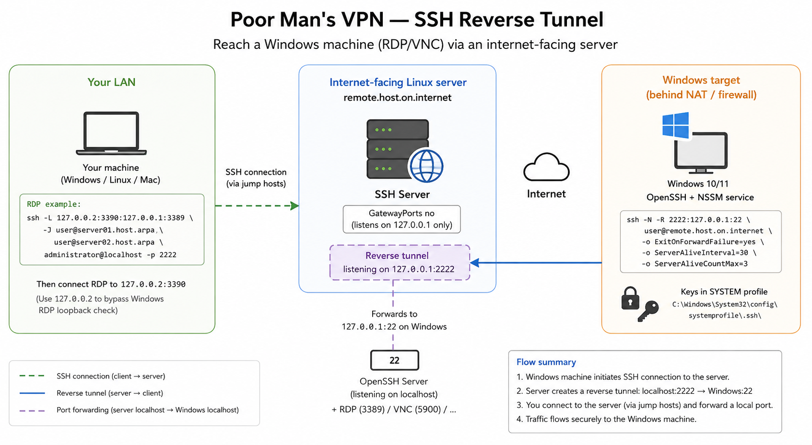

# Poor Man's VPN — SSH Reverse Tunnel on Windows 10/11

This guide describes how to set up a persistent SSH reverse tunnel from a Windows machine (target) back to an internet-facing server, allowing you to reach the Windows machine remotely via RDP or VNC without a traditional VPN.

---

## Prerequisites

- A Windows 10/11 target machine (the one you want to reach)
- A Linux server reachable from the internet (e.g. a VPS)
  This server acts as the middleman. Since the Windows machine typically sits behind a firewall or NAT and cannot be reached directly from the internet, it instead *calls out* to this Linux server and establishes a persistent reverse tunnel. Once the tunnel is up, the Linux server becomes the bridge through which you can reach RDP, VNC, or any other service on the Windows machine — without ever opening inbound ports on the Windows side.
- OpenSSH client/server installed on both ends

---

## Architecture overview



---

## Step 1 — Install OpenSSH Server on Windows

### Via GUI

**Windows 10:**
`Start` → search **"Optional features"** → **Manage optional features** → **Add a feature** → search for **OpenSSH Server** → **Install**

**Windows 11:**
`Settings` → `Apps` → `Optional features` → **View features** → search for **OpenSSH Server** → **Next** → **Install**

> The button is called "Add a feature" on W10 and "View features" on W11 — confusing, but both lead to the same place.

Once installed: `Start` → search **"Services"** → find **OpenSSH SSH Server** → right-click → **Properties** → Startup type: **Automatic** → **Start**

The firewall rule is created automatically during installation. Verify with:

```powershell
Get-NetFirewallRule -Name "OpenSSH-Server-In-TCP"
```

---

### Via PowerShell (for the command-line inclined)

Open PowerShell as Administrator:

```powershell
Add-WindowsCapability -Online -Name OpenSSH.Server~~~~0.0.1.0
Set-Service -Name sshd -StartupType Automatic
Start-Service sshd
```

Verify that the firewall rule was created automatically:

```powershell
Get-NetFirewallRule -Name "OpenSSH-Server-In-TCP"
```

If it is missing for some reason, create it manually:

```powershell
New-NetFirewallRule -Name "OpenSSH-Server-In-TCP" -DisplayName "OpenSSH Server (sshd)" `
  -Enabled True -Direction Inbound -Protocol TCP -Action Allow -LocalPort 22
```

---

## Step 2 — Generate SSH Keys (as SYSTEM)

The tunnel service runs as the SYSTEM account, so keys must be generated in SYSTEM's profile.

Download one of:
- [NirCmd](https://www.nirsoft.net/utils/nircmd.html) — `nircmdc.exe elevatecmd runassystem c:\windows\System32\cmd.exe`
- [PsExec](https://learn.microsoft.com/en-us/sysinternals/downloads/pstools) — `psexec -i -s cmd.exe`

In the SYSTEM cmd window:

```cmd
ssh-keygen -t ed25519 -f C:\Windows\System32\config\systemprofile\.ssh\id_ed25519 -N ""
```

> **Note:** Use `ed25519` instead of RSA — it's faster, more secure, and produces shorter keys.

Copy the public key to your remote server:

```cmd
type C:\Windows\System32\config\systemprofile\.ssh\id_ed25519.pub
```

Paste the contents into `~/.ssh/authorized_keys` on `user@remote.host.on.internet`.

---

## Step 3 — Pre-accept the Remote Host Key (avoid StrictHostKeyChecking)

Still in the SYSTEM cmd window, do a one-time manual connection to accept and store the host key:

```cmd
ssh -p 22 user@remote.host.on.internet
```

Type `yes` when prompted. This writes the host key to:
`C:\Windows\System32\config\systemprofile\.ssh\known_hosts`

Now you can use `StrictHostKeyChecking=yes` (or omit it entirely, as it defaults to yes) — no need to disable it.

---

## Step 4 — Configure the Remote Server

On `user@remote.host.on.internet`, verify `/etc/ssh/sshd_config`:

```
# Keep the reverse tunnel bound to localhost only (default, but make it explicit)
GatewayPorts no

# Keep connections alive
ClientAliveInterval 30
ClientAliveCountMax 3
```

Reload sshd if you changed anything:

```bash
sudo systemctl reload sshd
```

---

## Step 5 — Install NSSM and Create the Tunnel Service

Download [NSSM](https://nssm.cc/download) and place `nssm.exe` somewhere permanent (e.g. `C:\tools\nssm\`).

Create a `.bat` file, e.g. `C:\tools\ssh-tunnel\start-tunnel.bat`:

```bat
@echo off
"C:\Windows\System32\OpenSSH\ssh.exe" ^
  -i "C:\Windows\System32\config\systemprofile\.ssh\id_ed25519" ^
  -p 22 ^
  -N ^
  -R 2222:127.0.0.1:22 ^
  user@remote.host.on.internet ^
  -o ExitOnForwardFailure=yes ^
  -o ServerAliveInterval=30 ^
  -o ServerAliveCountMax=3 ^
  -o ConnectTimeout=30
```

Install as a service (run cmd as Administrator):

```cmd
C:\tools\nssm\nssm.exe install SSHTunnel "C:\tools\ssh-tunnel\start-tunnel.bat"
C:\tools\nssm\nssm.exe set SSHTunnel AppRestartDelay 10000
C:\tools\nssm\nssm.exe set SSHTunnel AppThrottle 5000
C:\tools\nssm\nssm.exe set SSHTunnel Start SERVICE_AUTO_START
net start SSHTunnel
```

`AppRestartDelay 10000` means NSSM will wait 10 seconds before restarting after a crash — combined with `ExitOnForwardFailure=yes` and `ServerAliveInterval`, dead tunnels are detected and restarted automatically.

---

## Step 6 — Connect from Your LAN

### RDP (Remote Desktop)

From a machine on your LAN, with `user@server01.host.arpa` as jump host:

```bash
ssh -L 127.0.0.2:3390:127.0.0.1:3389 \
    -J user@server01.host.arpa,user@server02.host.arpa \
    administrator@localhost -p 2222
```

Then connect RDP to `127.0.0.2:3390`.

> `server02.host.arpa` is the internal LAN address for `remote.host.on.internet`.

> **Why `127.0.0.2` and not `localhost` or `127.0.0.1`?**
> Windows RDP has a built-in loopback check: connecting to `localhost` or `127.0.0.1` results in the error *"Your computer could not connect to another console session on the remote computer because you already have a console session in progress."*
> Using `127.0.0.2` — which is a valid alias for the loopback interface on Windows — bypasses this check. Any port other than `3389` can be used on the left-hand side (here `3390`) to avoid conflicts if RDP is also running locally on the machine you connect from.

### VNC

```bash
ssh -L 127.0.0.2:5901:127.0.0.1:5900 \
    -J user@server01.host.arpa,user@server02.host.arpa \
    administrator@localhost -p 2222
```

Connect VNC client to `127.0.0.2:5901`.

---

## Step 7 — Verify and Manage the Tunnel

On `user@remote.host.on.internet`, check that port 2222 is listening:

```bash
netstat -tunpl | grep ':2222'
```

Close an existing tunnel connection cleanly:

```bash
pkill -f "ssh.*2222"
```

Or if you need to force-kill:

```bash
for pid in $(netstat -tunpl | awk '{print $7}' | grep ':2222' | cut -d'/' -f1); do
  kill -9 "$pid"
done
```

---

## Summary of Security Improvements vs Original

| Topic | Original | This guide |
|---|---|---|
| Key type | RSA (implicit) | ed25519 |
| Host key verification | `StrictHostKeyChecking=no` | Pre-accepted, checking enabled |
| Tunnel binding | Default | Explicit `GatewayPorts no` |
| Dead connection detection | None | `ServerAliveInterval` + `ServerAliveCountMax` |
| Service restart | Default NSSM | Tuned with `AppRestartDelay` |
| Kill command | `kill -9` loop | `pkill -f` (cleaner) |
